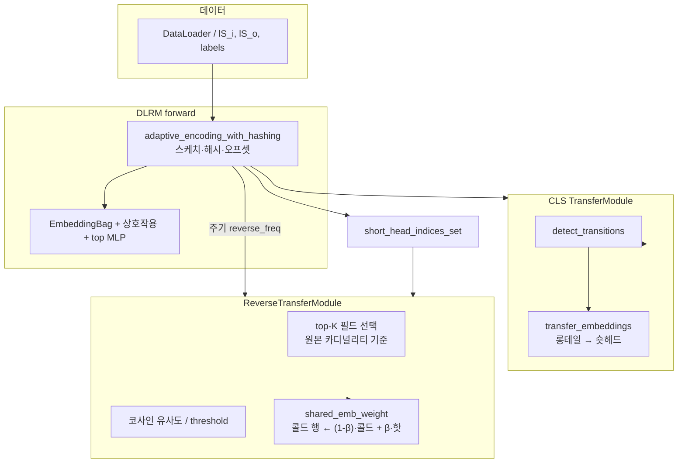

# Reverse Transfer가 포함된 CLS-LEAF 프레임워크 구조

LEAF 저장소에서 **적응 인코딩(Adaptive Encoding)** 위에 **CLS(TransferModule)** 를 얹고, 선택적으로 **Reverse Transfer** 를 붙인 학습 스택을 한곳에 정리한 문서입니다.

---

## 1. 한 줄 요약

| 구성요소 | 역할 |
|----------|------|
| **DLRM** (`dlrm_s_pytorch.py`) | sparse 임베딩 + 상호작용 + MLP 학습 루프 |
| **Adaptive Encoding** (`autoencoder.py` 등) | 압축 필드에 대해 롱테일/숏헤드 해시·스케치·`short_head_indices_set` 유지 |
| **CLS — `TransferModule`** (`transfer_module.py`) | 빈도 전환 시 **롱테일 → 숏헤드** 임베딩 이전(해마→신피질) |
| **Reverse — `ReverseTransferModule`** (`reverse_transfer.py`) | 같은 압축 필드 안에서 **숏헤드(핫) → 롱테일(콜드)** 직접 가중치 갱신(gradient-free) |

Reverse는 **CLS가 켜져 있고** `short_head_indices_set` 이 의미 있을 때만 동작하도록 설계되어 있습니다.

---

## 2. 의존 관계 (플래그)

```
--use-adaptive-encoding   (필수: 해시 풀 + 빈도 집합)
        ↓
--use-cls               (필수: 전환 감지·롱테일→숏헤드 transfer)
        ↓
--use-reverse-transfer  (선택: 숏헤드→롱테일 reverse)
```

`dlrm_s_pytorch.py` 에서 **Reverse만 켜는 것은 금지**됩니다.

```text
--use-reverse-transfer  ⇒  --use-adaptive-encoding AND --use-cls
```

---

## 3. 배치 단위 데이터 흐름



- **Forward 경로**: 매 배치 `batch_adaptive_encoding_with_hashing` 이 압축 필드 인덱스·오프셋·`short_head_indices_set` 을 갱신합니다.
- **CLS**: `transfer_module.update()` 가 전환을 감지하고 롱테일→숏헤드 임베딩을 옮깁니다(구현은 `emb_l` / 해시 버킷 기준).
- **Reverse**: `forward` 이후, `(j+1) % reverse_freq == 0` 일 때만 `ReverseTransferModule.transfer()` 호출.  
  공유 압축 테이블의 **`emb_l[첫_압축_테이블].weight.data`** 를 직접 수정합니다(`torch.no_grad()`).

---

## 4. 주요 파일 역할

| 파일 | 설명 |
|------|------|
| `dlrm_s_pytorch.py` | argparse, `get_capacity`·`compressed_table_mask`, `ReverseTransferModule` / `TransferModule` 초기화, 학습 루프에서 reverse 호출 조건·로그 |
| `reverse_transfer.py` | `ReverseTransferModule`, `ReverseTransferStats`, top-K 필드 선택, `transfer()` |
| `transfer_module.py` | `TransferModule`(CLS), reverse 모듈 optional import |
| `autoencoder.py` (및 adaptive 관련) | 온라인 빈도·스케치·`short_head_indices_set` 갱신 |
| `hash_embedding.py` | `HashEmbedding`, `get_hash_embedding_tensors` (reverse에서 0번째 해시로 대표 row) |
| `run_reverse.sh` | adaptive + cls + reverse + 주요 하이퍼 예시 한 번에 실행 |

---

## 5. Reverse Transfer 설계 제약 (코드 기준)

`reverse_transfer.py` 모듈 docstring과 구현이 맞추는 원칙입니다.

1. **기본 CLS-LEAF는 끄면 영향 없음** — `--use-reverse-transfer` 가 꺼져 있으면 기존 경로만 사용.
2. **배치에 등장한 feature만** — 추가 전역 메모리 없이, 해당 배치의 local id → global id 만 사용.
3. **gradient-free** — `transfer()` 내부 `torch.no_grad()` 로 옵티마이저가 아닌 직접 가중치 블렌딩.
4. **같은 압축 필드 내만** — 필드별로 핫/콜을 나누고, 유사도가 threshold 넘는 쌍만 업데이트.
5. **글로벌 인덱스** — `short_head_indices_set` 은 압축 풀의 global id (`local + cum_offset`).

---

## 6. CLI 하이퍼파라미터 (Reverse)

| 인자 | 의미 (기본값 참고: `dlrm_s_pytorch.py`) |
|------|----------------------------------------|
| `--use-reverse-transfer` | Reverse 활성화 |
| `--reverse-beta-min` / `--reverse-beta-max` | 학습 진행도에 따른 β 보간 (콜드 쪽에 핫을 섞는 비율) |
| `--reverse-sim-threshold-min` / `--reverse-sim-threshold` | 유사도 threshold 초반/후반 |
| `--reverse-freq` | 몇 배치마다 한 번 실행 (예: 1000) |
| `--reverse-top-k-fields` | 압축 필드가 많을 때, **원본 카디널리티** 상위 K개만 처리 |
| `--reverse-auto-select-min-fields` | 압축 필드 수가 이 값 이상일 때만 top-K 적용 |
| `--reverse-start-batch` | **0-based** 배치 인덱스 `j` 기준: `j >= start` 일 때만 reverse 실행 (기본 0) |
| `--reverse-stop-batch` | **0-based** 배치 인덱스 `j` 기준: `j < stop` 일 때만 reverse 실행. **-1이면 상한 없음** |

**배치 인덱스 주의**: 학습 루프의 `j`는 보통 **0부터 시작**합니다. 예를 들어 “처음 5만 배치만 reverse”는 `--reverse-stop-batch=50000` 입니다(5만 번째 배치는 `j=49999`까지 포함).

**Top-K 필드 카드**: `train_data.counts` 를 clamp 전에 `ln_emb_raw_counts` 로 복사해 두고, `ln_emb_raw_counts[compressed_table_mask]` 를 reverse 모듈에 넘겨 **원본 테이블 크기 기준**으로 정렬합니다 (`dlrm_s_pytorch.py`).

---

## 7. 예시 실행 스크립트

`run_reverse.sh` 는 대략 다음 조합을 고정합니다.

- `--use-adaptive-encoding --use-cls --use-reverse-transfer`
- CLS: `--cls-alpha-min/max`, `--cls-surge-k`, decay 관련
- Reverse: beta, threshold min/max, `reverse-freq`, top-K
- `--compression-ratio` 는 스크립트에서 예시로 지정; 필요 시 `"$@"` 로 덮어쓰기 가능

---

## 8. 로그에서 확인하는 법

Reverse가 돌 때 `dlrm_s_pytorch.py` 가 다음 형태로 출력합니다.

```text
[REVERSE] batch=... transferred=... beta=... threshold=...
  (freq=..., start=..., stop=..., comp_idx=[...], field=[...], Fi:count, ...)
```

- **`comp_idx`**: 압축 필드 로컬 인덱스 (0 … num_compressed-1)
- **`field`**: 원본 sparse 테이블 인덱스 (`global_field_ids`)

---

## 9. 관련 문서

- 레포 전체 개요: 상위 디렉터리 `LEAF_레포_구조_설명.md` (있는 경우)
- FALCON / SMED 등은 `falcon/FALCON.md` — 본 문서의 Reverse/CLS 스택과는 별 트랙이지만 같은 `dlrm_s_pytorch.py` 플래그 공간을 씁니다.

이 파일은 **Reverse + CLS + Adaptive** 가 어디에 붙는지 빠르게 공유하기 위한 용도로 유지하면 됩니다.
